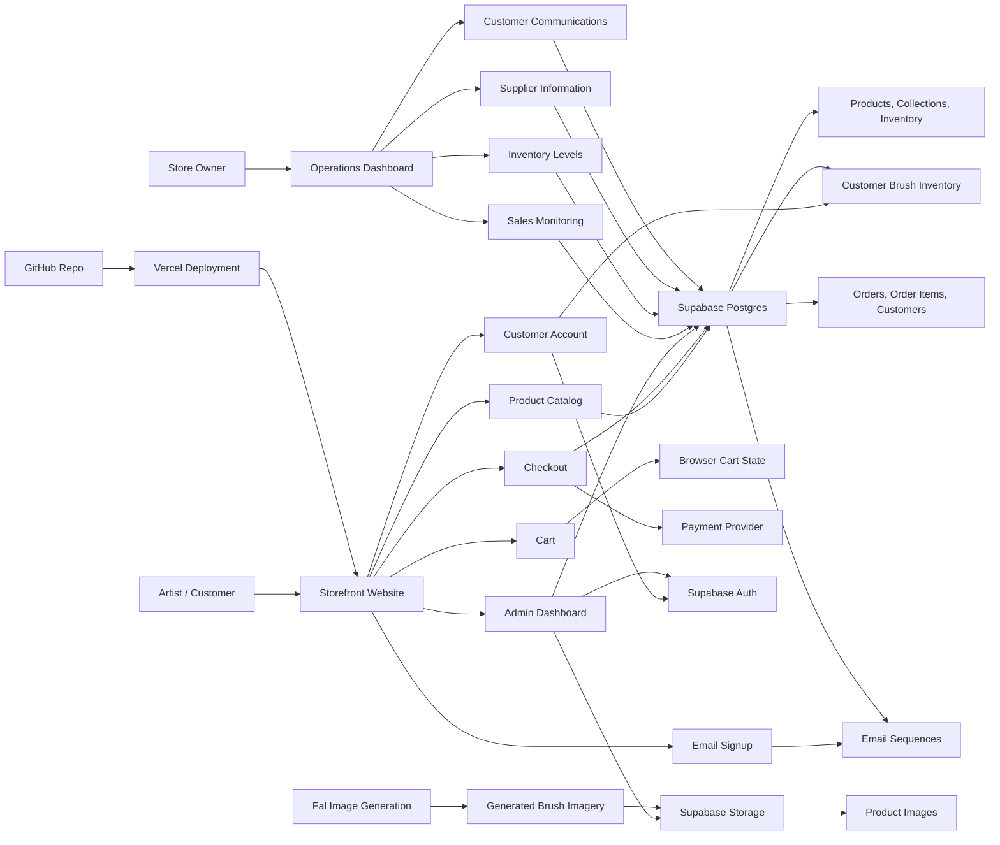
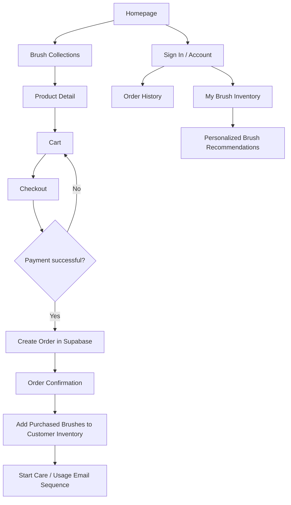
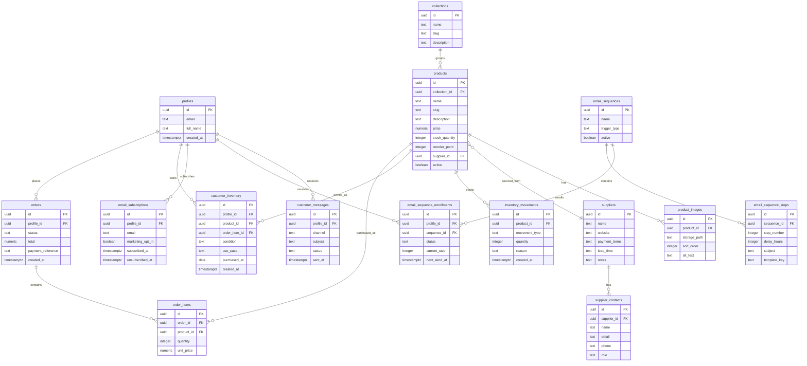
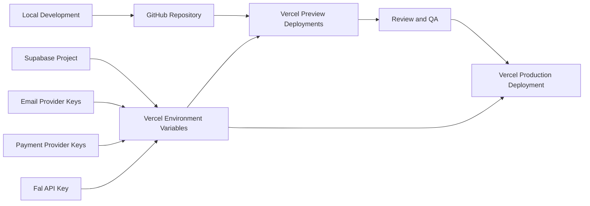
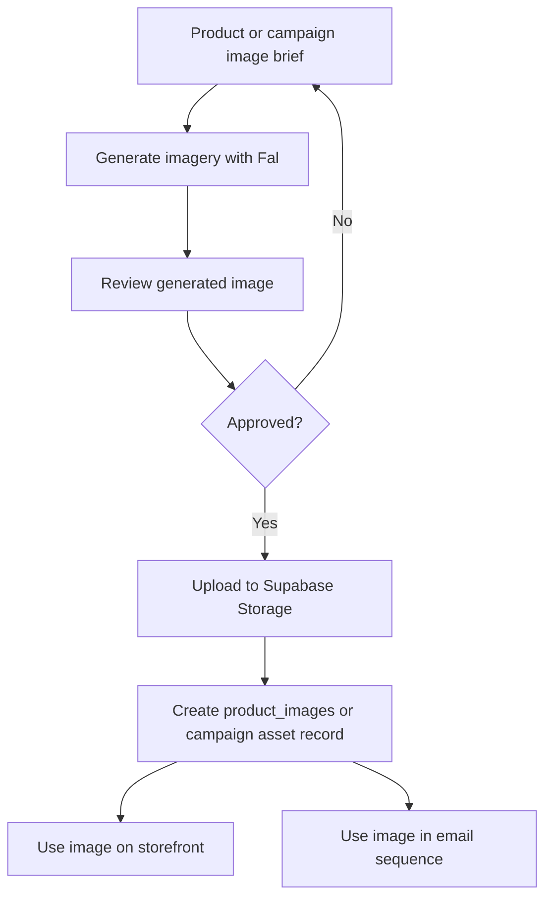
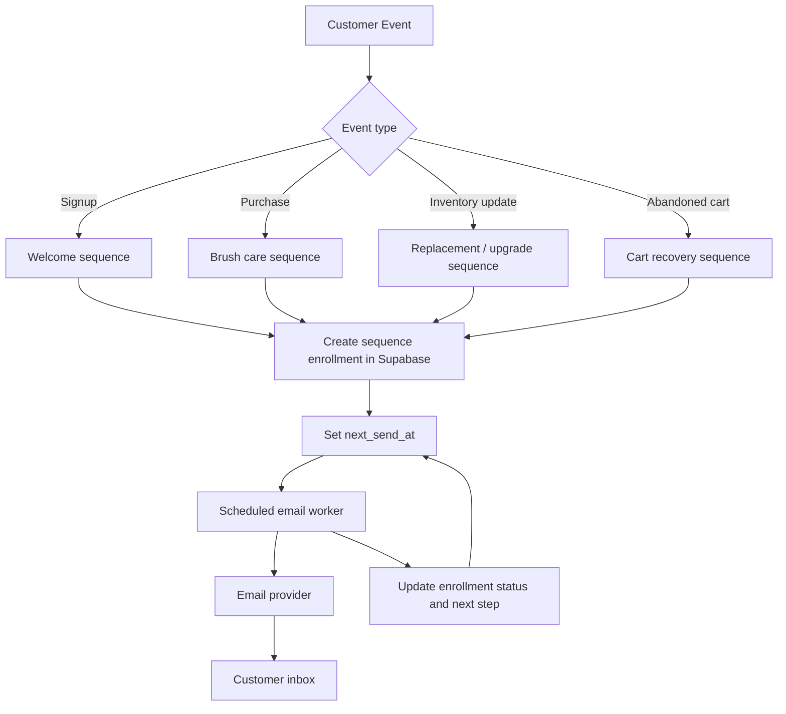
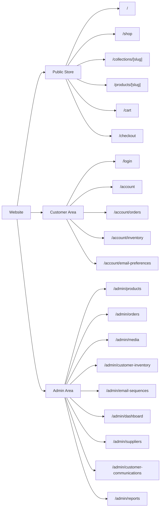

# Paint Brush Ecommerce Project Map

The current GitHub repository is empty, so this map represents the proposed first version of the project: a high-end paint brush ecommerce website for artists, deployed on Vercel, using Supabase for product data, customer accounts, customer inventory, email sequences, storage, supplier records, dashboard reporting, and order records.

## System Overview

## Customer Journey

## Data Model

## Supabase Responsibilities

```mermaid
flowchart TB
  supabase["Supabase Project"] --> auth["Auth"]
  supabase --> db["Postgres Database"]
  supabase --> storage["Storage"]
  supabase --> rls["Row Level Security"]

  auth --> customers["Customer sign in"]
  auth --> admins["Admin access"]

  db --> catalogTables["Product and collection tables"]
  db --> commerceTables["Orders and order items"]
  db --> profileTables["Customer profiles"]
  db --> inventoryTables["Customer inventory"]
  db --> emailTables["Email subscriptions and sequences"]
  db --> supplierTables["Suppliers and supplier contacts"]
  db --> reportingTables["Sales, inventory, and communication reporting"]

  storage --> productMedia["Product photos and brush detail images"]
  storage --> generatedMedia["Generated campaign and catalog imagery"]

  rls --> publicRead["Public read access for active products"]
  rls --> customerAccess["Customers can read their own orders"]
  rls --> inventoryAccess["Customers can manage their own inventory"]
  rls --> emailAccess["Customers can manage their own email preferences"]
  rls --> adminAccess["Admins can manage products, orders, inventory, suppliers, and email sequences"]
```

## Deployment Flow

## Image Generation Flow

## Dashboard Modules

```mermaid
flowchart TB
  dashboard["Operations Dashboard"] --> sales["Sales"]
  dashboard --> inventory["Inventory"]
  dashboard --> suppliers["Suppliers"]
  dashboard --> communications["Customer Communications"]

  sales --> revenue["Revenue, average order value, order volume"]
  sales --> products["Best-selling brushes and collections"]
  sales --> trends["Daily, weekly, and monthly sales trends"]

  inventory --> stock["Current stock by brush"]
  inventory --> reorder["Low-stock and reorder alerts"]
  inventory --> movements["Inventory adjustments and purchase receipts"]

  suppliers --> directory["Supplier directory"]
  suppliers --> contacts["Supplier contacts"]
  suppliers --> leadTimes["Lead times and payment terms"]

  communications --> sequences["Email sequence performance"]
  communications --> messages["Customer message history"]
  communications --> segments["Customer segments and opt-in status"]
```

## Email Sequence Flow

## Suggested Page Structure

## Build Order

1. Create the frontend app shell and visual design for a premium artist-focused brush store.
2. Add Supabase client setup and environment variables.
3. Create the Supabase schema for products, collections, images, profiles, orders, order items, customer inventory, and email sequences.
4. Add RLS policies: public catalog reads, customer-owned order reads, customer-owned inventory reads/writes, customer email preference management, and admin-only management.
5. Build product browsing, product detail pages, cart, and checkout flow.
6. Add customer account pages for order history, owned brushes, and email preferences.
7. Add the admin dashboard for sales monitoring, stock levels, supplier records, customer communications, brush listings, customer inventory, product images, and email sequences.
8. Add payment provider integration and order confirmation.
9. Add scheduled email sending through a server-side worker or edge function connected to an email provider.
10. Add the Fal image-generation workflow for product, campaign, and email imagery, storing approved assets in Supabase Storage.
11. Connect the GitHub repository to Vercel, configure environment variables, and use preview deployments for review before production.
